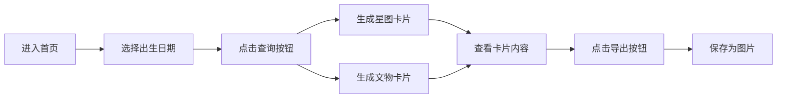

## 1. Product Overview
StellarStrata 是一个结合天文星图与历史文物的出生日期探索网站，让用户通过选择出生日期，探索当天的星空奥秘与历史文物发现。
- 为用户提供独特的出生日期纪念体验，连接星空与历史
- 目标用户为对天文和历史感兴趣的人群，寻求个性化纪念内容

## 2. Core Features

### 2.1 User Roles
| Role | Registration Method | Core Permissions |
|------|---------------------|------------------|
| Normal User | None | Browse and use basic functions |

### 2.2 Feature Module
1. **首页**: 日期选择器、提交按钮、卡片展示区
2. **星图卡片**: 显示出生日期当天的星座位置、行星信息
3. **文物卡片**: 显示历史上当天出土的文物信息
4. **导出功能**: 将卡片页面保存为图片

### 2.3 Page Details
| Page Name | Module Name | Feature description |
|-----------|-------------|---------------------|
| 首页 | 日期选择器 | 用户选择年、月、日来查询出生日期 |
| 首页 | 星图卡片 | 根据日期生成当天的星图展示，包含星座、行星位置 |
| 首页 | 文物卡片 | 根据日期查询历史上当天出土的文物信息 |
| 首页 | 导出功能 | 将生成的卡片页面导出为图片格式保存 |

## 3. Core Process
用户进入首页 → 选择出生日期 → 点击查询 → 系统生成星图和文物卡片 → 查看卡片内容 → 导出保存为图片

## 4. User Interface Design
### 4.1 Design Style
- 主色调：深紫色 (#4C1D95)、午夜蓝 (#1E1B4B)，搭配金色 (#FBBF24) 作为强调色
- 按钮风格：圆角矩形，渐变背景，悬停时有发光效果
- 字体：标题使用 serif 字体 (Playfair Display)，正文使用 sans-serif 字体 (Inter)
- 布局风格：卡片式布局，星空背景效果
- 图标风格：使用 lucide-react，精致线条风格

### 4.2 Page Design Overview
| Page Name | Module Name | UI Elements |
|-----------|-------------|-------------|
| 首页 | 日期选择器 | 现代化日历组件，年份选择器，美观的交互效果 |
| 首页 | 星图卡片 | 深色背景，星星装饰，星座连线图，行星信息展示 |
| 首页 | 文物卡片 | 卡片式布局，文物图片，名称，年代，出土信息 |
| 首页 | 导出功能 | 明显的导出按钮，支持点击后下载图片 |

### 4.3 Responsiveness
- Desktop-first 设计，支持响应式布局
- 移动端自动调整为单列卡片展示
- 触摸优化，按钮和交互区域适合移动端操作

### 4.4 3D Scene Guidance
- 星图卡片可使用 CSS 3D 效果营造星空深度感
- 使用 Canvas 绘制星座连线动画效果
