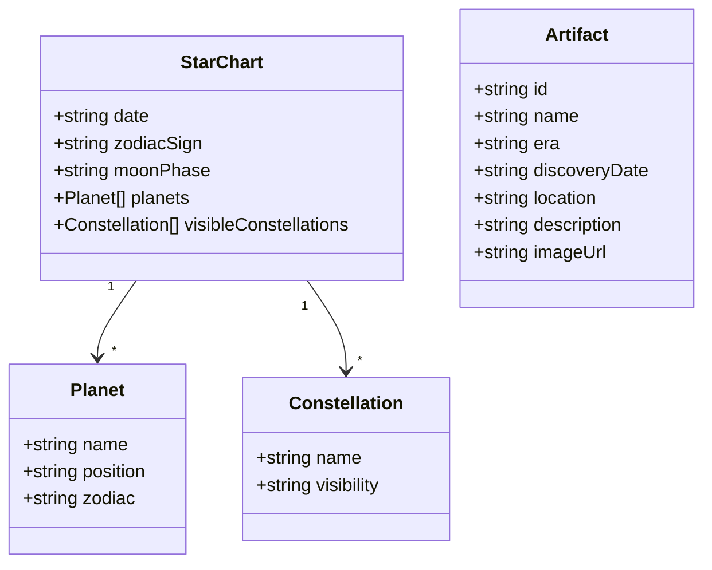

## 1. Architecture Design
```mermaid
flowchart LR
    A[Frontend\nReact + Tailwind] --> B[External APIs]
    B --> C[Astronomy API\n(星图数据)]
    B --> D[Heritage API\n(文物数据)]
    A --> E[Export Function\nhtml2canvas]
```

## 2. Technology Description
- Frontend: React@18 + TypeScript + tailwindcss@3 + Vite
- Initialization Tool: vite-init (react-ts template)
- Backend: None (使用外部API获取数据)
- Database: None (纯前端应用)
- Export Library: html2canvas (用于导出图片)

## 3. Route Definitions
| Route | Purpose |
|-------|---------|
| / | 首页，包含日期选择和卡片展示 |

## 4. API Definitions

### 4.1 星图数据 (模拟数据)
由于真实天文API需要复杂认证，使用模拟数据或简化的天文计算：
- 根据日期计算黄道十二宫
- 根据日期估算行星位置

### 4.2 文物数据 (模拟数据)
使用模拟的历史文物数据，包含：
- 文物名称
- 年代
- 出土日期
- 出土地点
- 文物描述
- 文物图片

## 5. Server Architecture Diagram
无后端服务，纯前端应用。

## 6. Data Model

### 6.1 Data Model Definition


### 6.2 Data Definition Language
无数据库，使用静态数据文件存储文物信息。

## 7. External Libraries
- html2canvas: 用于将页面元素导出为图片
- lucide-react: 图标库
- react-datepicker: 日期选择器组件

## 8. Project Structure
```
src/
  ├── components/
  │   ├── DatePicker.tsx      # 日期选择器组件
  │   ├── StarChartCard.tsx   # 星图卡片组件
  │   ├── ArtifactCard.tsx    # 文物卡片组件
  │   └── ExportButton.tsx    # 导出按钮组件
  ├── data/
  │   ├── artifacts.ts        # 文物模拟数据
  │   └── astronomy.ts        # 天文计算工具
  ├── hooks/
  │   └── useDataFetcher.ts   # 数据获取Hook
  ├── App.tsx                 # 主应用组件
  ├── main.tsx               # 入口文件
  └── index.css              # 全局样式
```
